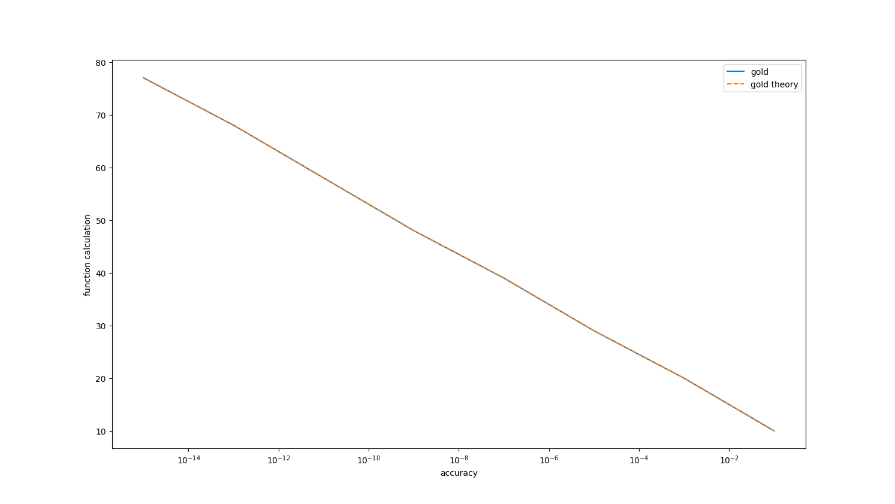
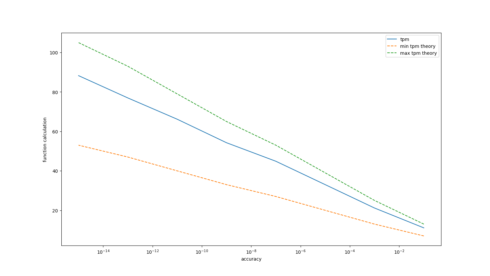
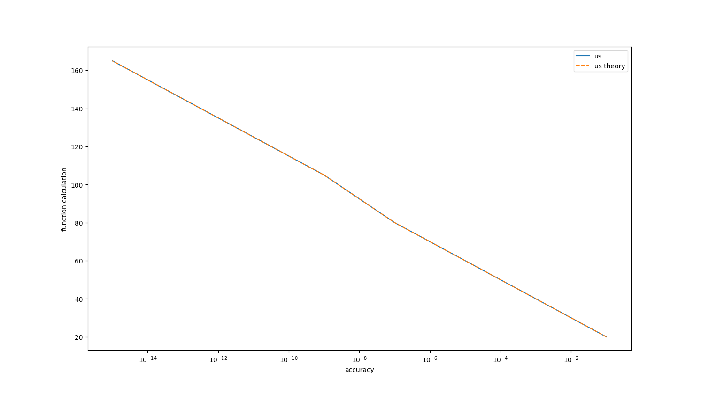
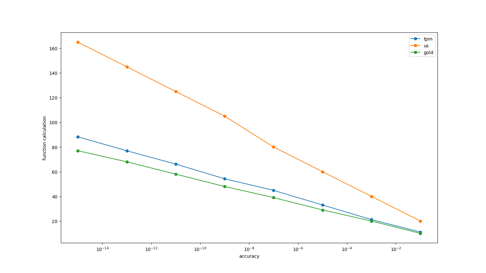

## Solving one-dimensional minimization problems
- [Solving one-dimensional minimization problems](#solving-one-dimensional-minimization-problems)
  - [Description](#description)
  - [Get started](#get-started)
  - [Project structure](#project-structure)
  - [Results](#results)


### Description

$f(x)=4x_1+x_2+4\sqrt{1+3x_1^2+x_2^2}$.

1. Find min f(x) on a given segment with an accuracy of [0.1, 0.01, 0.001] using three methods: the uniform search method, the trial point method and the golden section method
2. Compare methods. As a criterion, use the number of calls to the calculation of the function
3. Compare methods with theoretical estimates

### Get started
```bash
git clone https://github.com/IMZolin/one-dimension-minimization <your project name>
cd <your project name>
pip install -r requirements.txt
```

### Project structure
```bash
├───graphics            # images:graphics+scheme of simplex
├───report
│   └───lab3_opt_methods.pdf 
├───src                 # code
│   ├───golden_egg.py      # Golden Ratio Method
│   ├───main.py  # corner dots 
│   ├───One_D_Problem_file.py # one dimension minimization problem class
│   ├───result_analisys.py  # get results
│   ├───test_uniform.py # test code for running uniform search method
│   ├───result_analisys.py # get results
│   ├───Trial_Point_Method_file.py # Trial Point Method
└───────uniform_search.py # Uniform Search Method
```

### Results
1. Golden Ratio Method

2. Trial Point Method

3. Uniform Search Method

4. Comparison of methods

